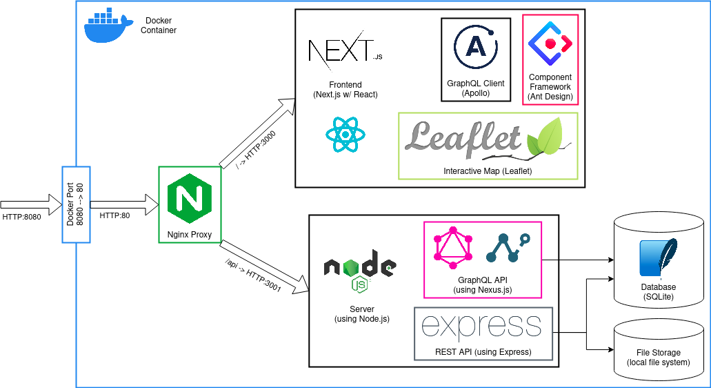

# Himalayan Drumming Research Dashboard

The Himalayan Drumming Research Dashboard is a web application developed for [Dr. Stefan Fiol](https://researchdirectory.uc.edu/p/fiolsn), originally as Scott Fasone's CS Masters Project under [Dr. Jillian Aurisano](https://researchdirectory.uc.edu/p/aurisajm). The goal of the application is to provide Dr. Fiol (and other ethnomusicologists) with a dashboard for storing, categorizing, and analyzing data they collect, currently on drumming in the [Garhwal](https://en.wikipedia.org/wiki/Garhwal_division) region of the Himalayas. The dashboard can then be used to explore research questions and simplify data interrogation. This data currently includes:

- video and audio recordings of drummers, including location
- notes on recordings
- villages in the region
- performers and genealogical relations of performers
- the relations between recordings, performers, and villages

## Architecture

The diagram below shows the current (development) architecture of the application.



### Docker Container

The entire application is packaged in a [Docker](https://www.docker.com/) image, for portability and ease of setup. In development mode, it currently forwards port 8080 to the container's port 80, which Nginx will listen on.

### Nginx Reverse Proxy

[Nginx](https://www.nginx.com/) is used to proxy incoming requests to either the frontend or the backend. Any request starting with `/api` is forwarded to the backend Nodejs server on port 3001, while all other requests will default to the frontend on port 3000 to be handled by the single-page application (SPA).

### Frontend

The frontend is written in [React](https://react.dev/) using [Next.js](https://nextjs.org/) for server-side rendering. All applicable code is in [TypeScript](https://www.typescriptlang.org/) instead of JavaScript.

The primary view is an interactive [Leaflet](https://leafletjs.com/) map of the Uttarakhand state in India. UI components are from [Ant Design](https://ant.design/), including two sidebars. The left sidebar is the [file browser](./frontend/src/components/FileBrowser/index.tsx) and the right sidebar contains both the [village browser](./frontend/src/components/VillageBrowser/index.tsx) and the [person browser](./frontend/src/components/PersonBrowser/index.tsx). [Apollo](https://www.apollographql.com/docs/react/) is used for communicating with the backend GraphQL API.

### Backend

The backend is also written in TypeScript running on [Node.js](https://nodejs.org/). The server includes a [GraphQL API](https://graphql.org/) for accessing all data from the database, and a REST API for uploading and fetching files. Both APIs access the database using [Prisma](https://www.prisma.io/) as an object-relational mapper (ORM). The [Prisma schema](./backend/prisma/schema.prisma) is used to define the program's database interface and the database schema itself. The GraphQL API is built using [Nexus](https://nexusjs.org/), which generates the [full schema](./backend/schema.graphql) from the codebase. The REST API (and technically the entire backend) is served using [Express](https://expressjs.com/).

### Database

The database is a relational database currently stored in [SQLite](https://www.sqlite.org/index.html). This should eventually be migrated to an actual relational database management system like [PostgreSQL](https://www.postgresql.org/) for scalability.

### File Storage

Currently the app looks at and serves all research files from the local filesystem. This should probably be migrated to some sort of cloud-based blob storage (like [Amazon S3](https://aws.amazon.com/s3/) or [Azure Blob Storage](https://azure.microsoft.com/en-us/products/storage/blobs)) in the future.

## Developing

### Prerequisites

This application uses a [Dev Container](https://code.visualstudio.com/docs/devcontainers/containers) for a portable development setup, and as such only requires [VSCode](https://code.visualstudio.com/) and Docker to be installed. For developers on Windows, we recommend using [Rancher Desktop](https://rancherdesktop.io/) as your container manager (with moby as the docker engine) and storing the code for this repository in [WSL](https://learn.microsoft.com/en-us/windows/wsl/install).

### Project Structure

- `.devcontainer`, files for configuring the Dev Container
- `.github`, hooks for GitHub Actions and Dependabot
- `.vscode`, editor configuration and recommend extensions
- [`backend`](./backend), **NPM project for the server-side**
- `blob`, directory that contains all research files
- `diagram`, random files used for documentation diagrams (like in this README)
- `docker`, files used for the production Docker image
- [`frontend`](./frontend), **NPM project for the client-side**
- `node_modules`, dependencies for the root NPM project
- `example.env`, file with example environment variables that should be copied into a proper `.env` file
- `graphql.config.json`, configuration for the VSCode GraphQL extension used for intellisense
- `package.json`, manifest for the root NPM project

### Getting Started

To launch the Dev Container for the project, open the repository with VSCode, install all recommended extensions (most importantly the "Dev Containers" extension), then run the "Dev Containers: Reopen in Container" VSCode command. It may take up to a minute to build and launch the development container.

After entering the Dev Container, install all dependencies by running `yarn` in the root of the workspace. This will install dependencies for the root NPM project, as well as the frontend and backend NPM projects. With dependencies installed, follow the directions in both the [frontend](./frontend/README.md) and the [backend](./backend/README.md) folders to get started.

After both the frontend and the backend are running, you can open <http://localhost:8080> in your browser to see the resultant web app! Requests on port 8080 will be forwarded to port 80 in the container, which Nginx will proxy to both the frontend (on port 3000) and backend (on port 3001).

### Common Pitfalls

- The Dev Container runs Nginx in the background to forward incoming connections to both the backend and the frontend. Sometimes this fails to start, so you may need to run the following commands:

```sh
# Check the status of Nginx
sudo service nginx status
# Restart Nginx if it isn't running
sudo service nginx restart
```

## Deployment

To run a full version of this application on your (or another) system, you'll need a Docker engine. As above, we
recommend Rancher Desktop for Windows users. After that, you'll need to open up a terminal in the root of this
repository and run the following commands:

```sh
# Startup the Docker container in the background, building if necessary.
docker compose -f docker-compose.test.yml up -d

# Check the logs of the running container
docker compose -f docker-compose.test.yml logs
```
